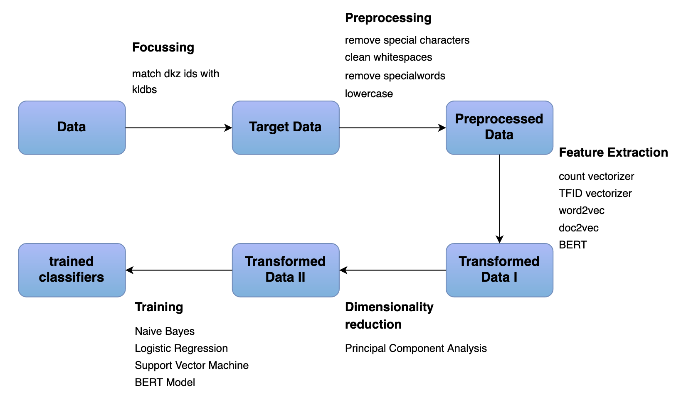

# Job Title Classification 

This repository provides the source code for the Masterthesis "Job Title Classification - A Comparision of Vectorization and Classification Techniques for German Job Postings". 

## A. File Structure 

The source code is structured as follows: 
```
src                                                            ├─ descriptive                                             
│  ├─ descriptive_analysis                                 
│  ├─ limitation_analysis                                  
├─ focussing                                               
├─ modeling                                                
│  ├─ LR                                                   
│  ├─ RF                                                   
│  ├─ SVM                                                  
│  ├─ training                                             
│  │  ├─ with_k_fold                                       
│  │  ├─ without_k_fold                                    
├─ predictions                                             
├─ preprocessing                                           
├─ reduction                                               
├─ vectorizer                                              
│  ├─ BERT                                                 
│  ├─ Doc2vec                                              
│  ├─ TFIDF                                                
│  ├─ countVectorizer                                      
│  ├─ word2vec                                             
├─ create_training_data.py                                 
└─ logger.py                                               
```

## B. Pipline of the Work
The pipeline of the work is presented below. The code is built in parallel to the steps of the pipeline. Transformed Data I refers to the vectorizer folder and Transformed Data II to the reduction. The training of the classification algorithms can be found in modeling/ training. There are two versions of the training. One with k-fold classification and one without. 



## C. Training the classifiers 
- The models used for the training process are not uploaded. Please create the vectorizer models by using the respecitve scripts in the folder vectorizer. 
- In order to train the classifiers without k-fold use the scripts ```modeling/training/without_k_fold./Level1.py``` and ```modeling/training/without_k_fold./Level3.py```. 
- To produce the visualizations for the prediction data run the files ```predictions/predictions_L1.py or predictions/predictions_L3.py```.


## D. Further Notes
- All necessary packages can be installed with the requirements.txt. 
- Due to the size of the dataset, the training will take some time. 
- The raw data cannot be made available. Instead, only the processed data is provided. All steps of the processing can be retraced via the scripts in preprocessing, focussing, as well as via the script ```create_training_data.py.```


